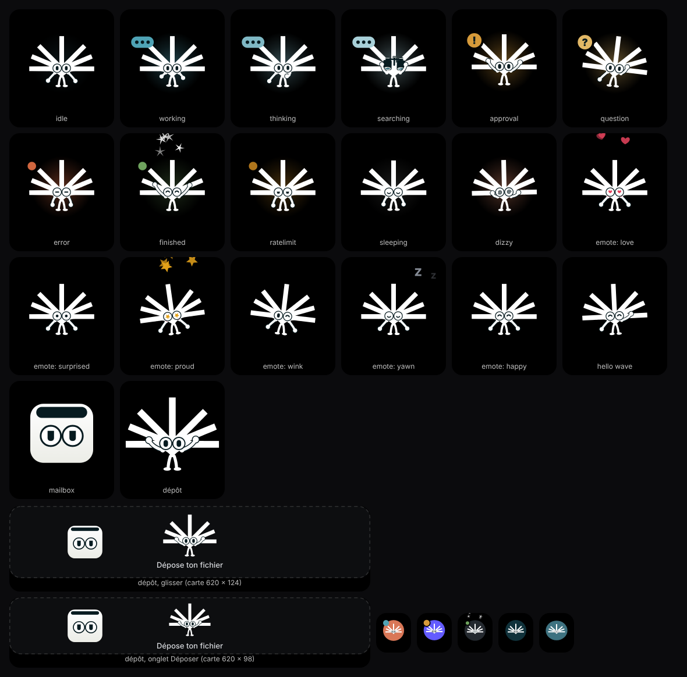

# Klayer Island

**Klay vit dans l'encoche de votre Mac et suit vos sessions Claude, dans l'app Claude comme dans Claude Code. Vous autorisez, répondez et relancez sans quitter ce que vous faites.**

Outil interne Klayer, fork de [Coucou](https://github.com/Louis-CFM/coucou) (licence MIT). Le nom, le personnage, l'icône et les sons sont propres à Klayer : voir [NOTICE.md](NOTICE.md).



## Klay

Klay est le glyphe Klayer avec deux yeux, des bras et des jambes. Le glyphe est tracé tel quel ; seuls les membres, les yeux et le halo coloré derrière les rayons bougent.

| État de l'agent | Ce que fait Klay |
|---|---|
| Au repos | respire, cligne des yeux, suit la souris du regard |
| Travaille | tape des deux mains et piétine sur place |
| Réfléchit | main au menton, regard en l'air |
| Cherche | lève des jumelles à deux mains, balaie l'horizon |
| Attend une autorisation | lève les deux bras et sautille |
| Pose une question | se gratte la tête, penché |
| Erreur | bras ballants, yeux plissés |
| Terminé | saute, fait un tour sur lui-même, bras en V |
| Limite atteinte | yeux fatigués, transpire |
| Dort | yeux fermés, des « z » s'envolent |

Cliquez-le : il se fâche. Trois clics rapides : il a le tournis. Clic droit : un emote « love ». Déposez un fichier sur l'île : il ouvre les bras, le suit des yeux et l'avale.

## Ce que fait l'app

- **Maison** : de gauche à droite, une bande d'icônes (Spotify, GitHub, Granola), Klay, puis vos conversations sur les trois quarts de la largeur. Un clic sur Spotify ou GitHub montre leur carte à la place des conversations, Granola ouvre une nouvelle note.
- **Conversations du jour** : vos sessions Claude, celles de l'app Claude comme celles de Claude Code dans un terminal ou un éditeur. D'abord celles en cours : une icône `</>` de la couleur de leur état, le nom de la session (sinon son premier message), et en dessous leur dernière action en clair (« Lit README.md », « Exécute npm test »). Puis, en gris, celles finies dans la journée, 10 au plus, effacées à minuit. La liste défile simplement : l'effet de roue est coupé pour l'instant, le temps de le vérifier sur macOS 27. Un clic ouvre la session : son onglet VS Code, l'app Claude, ou le terminal ou l'éditeur où tourne Claude Code.
- **Derniers choix** : sous les conversations, en gris, les 3 dernières autorisations et questions auxquelles vous avez répondu depuis l'île, avec l'heure et la réponse. L'historique reste sur votre Mac.
- **Autoriser et répondre depuis l'île** : les demandes d'autorisation de Claude Code (Allow, Deny, Always), les questions `AskUserQuestion` à choix simple ou multiple. Une demande en attente passe devant la maison.
- **Fin de session** : l'île s'ouvre sur la session qui vient de finir, avec sa dernière phrase et « Ouvrir cette session », qui ramène à son onglet VS Code, à son terminal ou à l'app Claude.
- **La carte s'efface** : quand vous passez dans l'app de la session (VS Code, l'app Claude), la carte d'autorisation ou de question se replie sans répondre ; vous répondez là-bas, ou vous la retrouvez sur l'île.
- **App Claude, onglet Code** : une demande de Claude qui n'a pas sa carte dans l'île (une autorisation, le formulaire d'un serveur MCP) ouvre l'île sur « Claude attend ta réponse », avec « Ouvrir cette session ». Repose sur les hooks officiels de Claude Code, pas sur l'interface de l'app.
- **App Claude, Chat et Cowork (expérimental)** : avec l'accès Accessibilité, l'île lit les boutons de l'app Claude et s'ouvre quand une réponse se termine ou qu'une autorisation vous attend pendant que vous êtes dans une autre app, avec « Ouvrir ce chat ». Elle ne lit jamais le texte des messages et ne clique jamais dans l'app Claude. Le suivi dépend des libellés de l'interface d'Anthropic ; un diagnostic à copier sert à les régler. Réglages → Agents.
- **Chat** : Claude Haiku, par le Claude Code installé sur votre Mac et votre forfait Claude. Le modèle est fixe, le chat n'a aucun outil et l'app ne stocke ni clé ni jeton. Il s'ouvre sans contexte : seuls un fichier déposé puis « Poser une question », Klay glissé sur une fenêtre ou ⌃⌥W lui en donnent un. Il faut Claude Code installé et connecté avec votre compte claude.ai.
- **Quotas** : limites 5 heures et hebdomadaires de Claude dans l'en-tête de l'île.
- **Dépôt de fichier** sur l'île, puis question à Claude (image, PDF ou texte) ou email : Klay prépare un brouillon dans votre Gmail, par le connecteur Gmail de votre compte Claude. L'île n'envoie jamais rien : vous relisez le brouillon, vous y ajoutez la pièce jointe à la main et vous l'envoyez depuis Gmail.
- **Klay sur le bureau** : ⌃⌥D l'envoie flotter sur le bureau ; il rentre à pied quand un agent a besoin de vous, au double-clic ou à ⌃⌥D. Glissé hors de l'île sur une fenêtre, il y attache son contexte, puis rentre à pied lui aussi.
- **GitHub** : PR, revues et CI dans la carte de son icône, dans la bande de la maison. Une CI en échec ou une revue demandée met un badge sur l'icône.
- **Spotify** : carte de lecture (pochette, progression, volume) dans la bande de la maison. Klay danse quand Spotify joue.
- **Raccourcis clavier** globaux, modifiables dans Réglages → Raccourcis.
- **10 langues**, dont le français.
- **Aucune télémétrie, aucun compte.** L'app ne parle qu'aux services que vous branchez.

Retirés par rapport à Coucou : clé API Anthropic, sélecteur de modèle et recherche web du chat, envoi d'email par Mail.app, widgets, synchronisation entre appareils, versions hors Mac, garde-robe et tenues de Mochi, mode démo, récap hebdomadaire, pastilles d'éditeurs (VS Code, Cursor), boutons terminal et éditeur, cartes de diff et compteurs +N −M.

## Installer

Pas de release publique : la diffusion reste interne. Construisez depuis les sources.

L'app est réservée au Mac (macOS 15+, Xcode 16+, [XcodeGen](https://github.com/yonaskolb/XcodeGen)) :

```bash
brew install xcodegen
cd NotchBuddy
xcodegen
open NotchBuddy.xcodeproj   # puis ⌘R
```

Renseignez votre équipe Apple dans `DEVELOPMENT_TEAM` (`NotchBuddy/project.yml`) pour signer.

## Configurer

Icône Klayer Island dans la barre des menus → **Réglages…**

| Quoi | Pourquoi | Où |
|---|---|---|
| Hooks Claude Code | sessions en direct et autorisations | **Install hooks** : l'app montre les entrées du bloc `hooks` de `~/.claude/settings.json` qui changent, puis écrit après votre confirmation, avec une sauvegarde datée. Elle ne touche qu'à ses propres entrées. **Uninstall** suit la même étape |
| App de bureau Claude, onglet Code | ses sessions dans la maison, ses demandes dans l'île | rien à installer : le relais des hooks Claude Code la reconnaît ; détail dans [docs/AGENTS.md](docs/AGENTS.md) |
| App de bureau Claude, Chat et Cowork | fin de réponse et autorisation (expérimental) | Réglages → Agents → **App Claude : Chat et Cowork** : interrupteur activé par défaut, puis **Autoriser l'accès** (Accessibilité de macOS) |
| Claude Code connecté | chat et brouillon d'email | rien à saisir dans l'app. `claude auth status` doit afficher `claude.ai` ; sinon ouvrez un terminal, lancez `claude` puis `/login`. Sans Claude Code, l'île propose de l'installer |
| Connecteur Gmail | brouillon d'email | à ajouter à votre compte sur claude.ai. Sans lui, la carte email le dit |
| Quotas Claude | jauge dans l'en-tête | Réglages → Agents → Plan usage → **Install relay** |
| GitHub | PR, revues et CI | Réglages → Integrations : jeton personnel rangé dans le trousseau, optionnel |

Si l'app ne tourne pas, le hook rend la main immédiatement : **Claude Code n'est jamais bloqué.**

**Avant de partager l'app à l'équipe** : la lecture des conditions d'Anthropic sur l'usage de Claude Code (spec de conception §7, dans `docs/superpowers/specs/`) attend la validation d'un fondateur.

## Développer

- Le dessin de référence de Klay est `tools/klay-preview/src/engine.ts` (Canvas 2D), que le code Swift de `KlayerIslandKit` reprend. Ce banc de rendu ne fait pas partie de l'app. Pour voir tous les états côte à côte : `cd tools/klay-preview && npm install && npx vite`, puis ouvrez la page affichée ; `?freeze=1.2` fige l'animation pour une capture.
- Le glyphe (`tools/klay-preview/src/glyph.ts`) est généré depuis le SVG officiel du design system Klayer : ne le modifiez pas à la main.
- Sons : `python3 scripts/gen-sounds.py`. Icônes : `node scripts/render-mac-icons.mjs`.
- Tests : scripts `scripts/test-*.sh` (nécessitent macOS). Banc de rendu : `cd tools/klay-preview && npm run check`.
- Test de bout en bout : la CI macOS construit une app de test, jamais livrée, et vérifie avec `scripts/test-e2e-island.sh` qu'une fin de session, une autorisation et une question de l'app Claude s'affichent dans l'île et que les réponses de l'île repartent vers Claude Code (étape « End-to-end island test »). Le script est fait pour la CI, pas pour votre Mac.
- Règles pour les agents de code : [CLAUDE.md](CLAUDE.md).

## Licence

Code sous [licence MIT](LICENSE), copyright Louis Raillé pour le code d'origine et Klayer pour les modifications. Nom, personnage Klay, icône et sons : Klayer. Détail dans [NOTICE.md](NOTICE.md).
